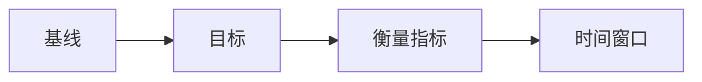
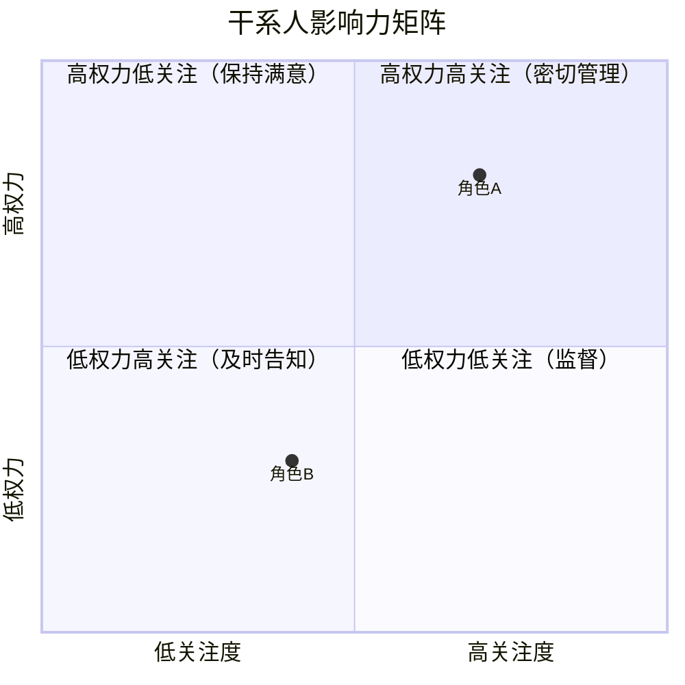
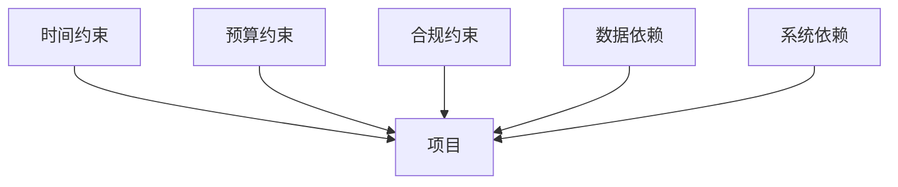

# 项目背景与目标

> 项目类型：待确认（重构 / 从 0 到 1 / 迭代）
> 一句话摘要：待补充
> 治理伴随文件：background-goal.governance.md
>
> **类型分支（lite 注释）**：本模板用 HTML 注释标记各节在「迭代」类型下是否可裁剪。
> - 必留节（一句话摘要 / 当前现状 / 核心问题与证据 / 目标与成功判断 / 待确认与风险 / 参考资料）无论何种类型都应保留；
> - 可裁剪节（术语与缩略词 / 项目背景 / 角色与干系人 / 约束与依赖 / 边界与非目标）在迭代类型下若内容少或与其他文档重复，可裁剪。裁剪判断由 PM 在 Generate 阶段做，校验器对裁剪节仅发 advisory warning，不阻断。

## 一句话摘要

<!-- 必留 / 迭代必留 -->

用一句话说明谁在什么业务情境下，要解决什么问题并获得什么结果。

## 术语与缩略词

<!-- 可选（跨团队项目推荐；迭代类型下若术语少可裁剪） -->

<!-- 对照企业 BRD 惯例（DP/RSVP BRD 均有名词解释节）：跨团队项目术语密集，集中定义避免新人逐词猜测。只列在正文出现的术语；材料已定义的直接沿用并标来源，材料未定义的不编造。 -->

| 术语 / 缩略词 | 说明 | 来源 |
|---|---|---|
| 待确认 | 待确认 | 待确认（材料定义 / 沿用企业惯例 / 需澄清） |

## 项目背景

<!-- 可裁剪（迭代类型下若与下游 user-journey.md 的「业务背景」重复，可裁剪） -->

说明业务由来、为什么现在需要处理，以及这件事对业务的意义。只写材料支持的内容；推断或待确认内容要明确标出。

## 当前现状与已有做法

<!-- 必留 / 迭代必留（仅保留与本次改动直接相关的现状） -->

说明现在如何完成这件事，包括系统、人工或线下步骤。重构项目必须写清楚“之前是什么样”；从 0 到 1 项目必须写清楚线下/人工流程；迭代项目只保留与本次改动直接相关的现状。

## 核心问题与证据

<!-- 必留 / 迭代必留 -->

按“问题 -> 影响 -> 证据”描述。不要把“需要某个功能”直接当作问题。没有证据的内容写为待确认。

**问题链路图（mermaid flowchart，必画）**——把核心问题、影响、证据链路可视化，避免读者通读全节才能形成图景：

## 目标与成功判断

<!-- 必留 / 迭代必留 -->

> 目标分**业务目标**与**用户目标**两列；衡量方式用「基线 → 目标 + 时间窗口 + 数据源」三件套（来自 BRD 常见做法）。

| 目标类型 | 目标描述 | 基线 | 目标 | 衡量指标 | 时间窗口 | 数据源 |
|---|---|---|---|---|---|---|
| 业务 | 待补充 | 待确认 | 待确认 | 待确认 | 待确认 | 待确认 |
| 用户 | 待补充 | 待确认 | 待确认 | 待确认 | 待确认 | 待确认 |

> - 业务目标：业务方希望看到的结果（营收 / 转化 / 成本 / 风控 / 体验等）
> - 用户目标：用户希望得到的结果（任务完成 / 时间缩短 / 体验改善 / 信任增强等）
> - 衡量指标：可量化指标（转化率 / 满意度 / 留存 / 跳出率 / 客单价 / 工时缩短 等）
> - 时间窗口：基线与目标对比的起止时间（例：2024-Q3 上线 → 2024-Q4 复盘）
> - 数据源：数据从哪个系统/报表取（例：BI 报表 / 客服回访 / 灰度对比 / 用户访谈 等）
> 
> 暂时不能量化时，写清楚待确认的判断方式（例：通过运营访谈、用户回访定性判断；或对照试点数据）。

**目标链路图（mermaid flowchart，必画）**——把基线→目标→衡量指标→时间窗口串成链路，PM 一眼看清立项逻辑：

## 角色与干系人

<!-- 可裁剪（迭代类型下若仅涉及单一角色或与下游 user-journey.md 的「角色旅程」重复，可裁剪） -->

列出与背景、问题和目标直接相关的角色，以及他们受到的影响、承担的责任或需要做出的决定。详细用户旅程留给下游 skill。

**干系人影响力矩阵（mermaid quadrantChart，可选但推荐）**——把角色按「权力 × 关注度」分四象限，谁拍板谁执行一眼看清：

## 约束与依赖

<!-- 可裁剪（迭代类型下若仅是技术细节或与下游 page-design 重复，可裁剪） -->

记录已知的时间、预算、合规、组织、数据、系统和外部依赖。未知项不要假装没有。

**约束/依赖关系图（mermaid graph，可选）**——把约束按类别（时间/预算/合规/组织/数据/系统/外部）画出依赖关系，避免散落在表格里：

## 边界与非目标

<!-- 可裁剪（迭代类型下边界通常由 user-stories / page-design 约束，可裁剪） -->

说明本次背景目标覆盖什么、不覆盖什么，以及哪些范围需要后续确认。这里不写功能清单。

## 待确认与风险

<!-- 必留 / 迭代必留 -->

用自然语言列出会影响目标、范围、成本、时间或风险的未决事项，并说明不确认的后果。详细问题记录放在治理伴随文件。

## 参考资料

<!-- 必留 / 迭代必留 -->

列出实际使用过的会议、口述、PPT、图片、文档或数据来源，使用人可读的标题、日期和位置/链接。
